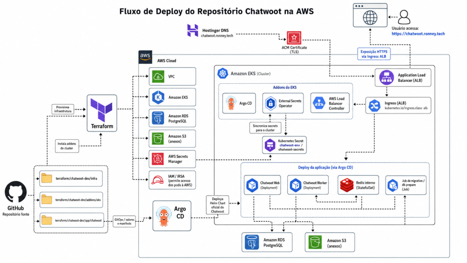

# chatwoot_deploy_arquitetura

# Arquitetura e Fluxo de Deploy — Chatwoot na AWS (EKS + Terraform + ArgoCD + Grafana + Prometheus)

## Visão Geral

Este projeto implementa o deploy do **Chatwoot** em Kubernetes (EKS)
utilizando uma arquitetura baseada em:

- **Terraform** para provisionamento da infraestrutura AWS
- **Terraform + Helm** para instalação de addons no cluster
- **ArgoCD (GitOps)** para deploy da aplicação
- **Helm Chart oficial do Chatwoot** para instalar os recursos
Kubernetes

A arquitetura está organizada em três camadas principais:

1. Infraestrutura AWS
2. Addons do cluster Kubernetes
3. Aplicação Chatwoot via GitOps com ArgoCD




---

# Estrutura do Projeto

```
terraform/chatwoot-dev/infra
terraform/chatwoot-dev/addons/eks
aplicação/chatwoot
```

Cada diretório possui responsabilidades específicas dentro do fluxo de
deploy.

```jsx
terraform/
├── chatwoot-dev/                    # Ambiente de desenvolvimento
│   ├── infra/                       # Infraestrutura
│   │   ├── main.tf                  # Cria as VPC, EKS, RDS, Redis, S3, ECR, Secret
│   │   ├── variables.tf             # Variáveis de Nome, CIDR VPC, Especificações do Node, RDS e Redis.
│   │   ├── outputs.tf               # Valores exportados da VPC, Subnets, endpoint, ECR, Bucket S3, RDS, OIDC e Redis.
│   │   ├── providers.tf             # AWS provider
│   │   ├── backend.tf               # Cria a Tabela do backend remoto do Terraform no S3 usando lock no DynamoDB
│   │   └── terraform.tfvars         # Arquivos de Plano Gerados pelo Terraform.
│   │
│   ├── addons/eks/                  # Addons do Kubernetes, Instala componentes dentro do Cluster EKS. 
│   │   ├── addons.tf                # Instala Load Balancer, ExternalDNS, ArgoCD, Metrics Server e cria policies IAM, roles IRSA e service accounts para os controllers.
│   │   ├── argocd.tf                # Configuração ArgoCD, como namespace, ingress com ALB para acesso por "argocd.ronney.tech".
│   │   ├── access.tf                # IAM Access Entry, Cria acessos ADM ao EKS para o usuário("projeto_chatwoot"), ele é associado a policy`AmazonEKSClusterAdminPolicy` usando `aws_eks_access_entry`.
│   │   ├── backend.tf               # Configura o backend remoto dessa camada direto no S3
│   │   ├── providers.tf             # Kubernetes + Helm providers
│   │   ├── providers-k8s.tf         # Declara os Providers usados nas camada "Aws", "K8s" e "helm"
│   │   ├── remote_state.tf          # Le o estado remoto da camada `infra` e transforma outputs importantes em `locals`, como nome do cluster, VPC ID, OIDC provider e bucket de anexos.
│   │   ├── external_secrets.tf      # Instala o External Secrets Operator e cria a Role IRSA que permite ler os secrets dentro do AWS Secrets Manager.
│   │   ├── chatwoot-irsa.tf         # Cria a policy IAM e a Role IRSA da aplicação Chatwoot para acessar o bucket S3. A Trust Policy aponta para a service account "chatwoot" dentro da namespace "chatwoot".
│   │   ├── output.tf                # Expoe os outputs dos Addons.
│   │   └── variables.tf             # Variáveis dos addons
│   │
│   └── aplicação/chatwoot/          # Configuração Chatwoot
│       ├── application.yaml         # Busca os Charts Helm oficial e usa o Values.yaml do repositório.
│       └── values.yaml              # Helm chart values, Define: ServiceAccount, Ingress ALB, Certificados ACM HTTPS, ExternalDNS, RDS, Redis, Secrets, variaveis de ambientes e probes dos pods.
│
│──────── aplicação/chatwoot/bootstrap      # Esta pasta prepara os recursos minimos que precisam existir antes do chart principal do Chatwoot consumir secrets.
│         ├── application.yaml              # GitOPS, cria um Application,
│         ├── values.yaml                   # Helm chart values, Define: ServiceAccount, Ingress ALB, Certificados ACM HTTPS, ExternalDNS, RDS, Redis, Secrets, variaveis de ambientes e probes dos pods.
│         ├── secret.yaml                   # Cria um `SecretStore` do External Secrets apontando para o AWS Secrets Manager na regiao `us-east-1`.
│         ├── namespace.yaml                # Cria o Namespace chatwoot
│         ├── externalsecret-chatwoot.yaml  # Cria o secret Kubernetes `chatwoot-secrets` a partir do AWS Secrets Manager.
│         └── kustomization.yaml            # Lista os manifest que serão aplicados.
│
│──────── aplicação/chatwoot/chatwoot-db    # Banco Chatwoot
│         ├── serviceaccount-chatwoot.yaml  # Cria a service account `chatwoot` no namespace `chatwoot` com anotacao IRSA para assumir a role `chatwoot-dev-chatwoot-irsa`.
│         ├── chatwoot-db-prepare.yaml      # 
│         └── chatwoot-db-migrate.yaml      # Helm chart values, Define: ServiceAccount, Ingress ALB, Certificados ACM HTTPS, ExternalDNS, RDS, Redis, Secrets, variaveis de ambientes e probes dos pods.

```

---

# Infraestrutura AWS

Diretório:

```
terraform/chatwoot-dev/infra
```

## Objetivo

Provisionar toda a infraestrutura base necessária para executar o
Kubernetes e a aplicação.

## Recursos criados

### Backend remoto do Terraform

Arquivo:

```
backend.tf
```

Responsável por:

- armazenar o state no **S3**
- utilizar **DynamoDB para lock de state**
- evitar conflitos em execuções paralelas

---

### VPC e rede

Cria:

- VPC
- subnets públicas
- subnets privadas
- NAT Gateway
- route tables

Função:

Permitir que o EKS execute workloads privados enquanto expõe serviços
via load balancer.

---

### Cluster EKS

Provisiona:

- cluster Kubernetes gerenciado
- node group gerenciado
- configuração de acesso ao cluster

Esse cluster será a base para executar todos os workloads.

---

### ECR

Cria repositórios Docker.

Função:

Armazenar imagens de containers utilizadas pelo sistema.

---

### S3 para anexos

Cria bucket S3 com:

- versionamento
- criptografia
- bloqueio de acesso público

Esse bucket será utilizado pelo Chatwoot para armazenar anexos.

---

### Banco PostgreSQL (RDS)

Cria:

- instância PostgreSQL gerenciada
- senha aleatória
- credenciais armazenadas no Secrets Manager

Esse banco será o banco principal do Chatwoot.

---

### Redis (ElastiCache)

Provisiona Redis gerenciado.

Observação: O deploy atual do Chatwoot utiliza Redis interno do Helm
Chart.

---

### Security Groups

Permitem comunicação entre:

- nodes do EKS
- RDS
- Redis

---

### Outputs

Expondo informações para outros módulos:

Exemplos:

- cluster name
- vpc id
- rds endpoint
- bucket S3
- ARN de secrets

Esses dados são consumidos pelo módulo de addons.

---

## Execução

```
cd terraform/chatwoot-dev/infra
terraform init
terraform plan
terraform apply
```

---

# Camada 2 — Addons do Cluster Kubernetes

Diretório:

```
terraform/chatwoot-dev/addons/eks
```

## Objetivo

Instalar componentes necessários para operação do cluster.

Esse módulo **não cria o EKS**, ele utiliza o cluster já criado.

---

## Remote State

Arquivo:

```
remote_state.tf
```

Permite acessar os outputs do módulo `infra`.

Exemplos de dados consumidos:

- cluster name
- vpc id
- oidc provider
- subnets

---

# Componentes instalados

## Metrics Server

Instalado via Helm.

Função:

- fornecer métricas básicas do cluster
- habilitar autoscaling (HPA)

---

## AWS Load Balancer Controller

Responsável por criar **ALB automaticamente** a partir de recursos
Ingress.

Provisionamento inclui:

- IAM Policy
- IAM Role
- IRSA
- ServiceAccount
- instalação Helm

Fluxo:

Ingress → Controller → cria ALB na AWS

---

## ExternalDNS

Responsável por criar registros DNS automaticamente no Route53.

Fluxo:

Ingress → ExternalDNS → cria registro DNS.

---

## ArgoCD

Ferramenta GitOps que será responsável por instalar a aplicação.

Provisionamento inclui:

- namespace argocd
- helm release do ArgoCD

---

## Execução

```
cd terraform/chatwoot-dev/addons/eks
terraform init
terraform plan
terraform apply
```

---

# Camada 3 — Aplicação Chatwoot (GitOps)

Diretório:

```
aplicação/chatwoot
```

Essa camada define **como a aplicação será implantada** no cluster.

---

## Namespace

Arquivo:

```
namespace.yaml
```

Cria namespace:

```
chatwoot
```

Isolando os recursos da aplicação.

---

## Secrets

Arquivo:

```
secret.yaml
```

Define variáveis sensíveis:

- SECRET_KEY_BASE
- POSTGRES_PASSWORD
- REDIS_PASSWORD

Esses dados são utilizados pelo Chatwoot.

---

## Values.yaml

Arquivo de configuração do Helm Chart do Chatwoot.

Define:

- Ingress com ALB
- hostname da aplicação
- certificado ACM
- uso de RDS externo
- uso de S3 para anexos
- Redis interno

---

## Application.yaml

Cria um recurso **Application do ArgoCD**.

Esse recurso diz ao ArgoCD para instalar o Chatwoot via Helm.

---

# Fluxo de Deploy

## Etapa 1 — Infraestrutura AWS

```
terraform/chatwoot-dev/infra
```

Provisiona:

- VPC
- EKS
- RDS
- Redis
- S3
- ECR

---

## Etapa 2 — Addons Kubernetes

```
terraform/chatwoot-dev/addons/eks
```

[Chatwoot na AWS](https://www.notion.so/Chatwoot-na-AWS-3118bafb39d8803993baeb495721c219?pvs=21)

Instala:

- Metrics Server
- AWS Load Balancer Controller
- ExternalDNS
- ArgoCD

---

## Etapa 3 — Aplicação Chatwoot

```
aplicação/chatwoot
```

Deploy via ArgoCD:

1. ArgoCD lê o Application
2. baixa Helm Chart do Chatwoot
3. aplica values.yaml
4. cria Deployment, Service e Ingress

---

# Fluxo de criação de recursos

```
Terraform Infra
    ↓
Cluster EKS
    ↓
Terraform Addons
    ↓
Metrics Server
ALB Controller
ExternalDNS
ArgoCD
    ↓
ArgoCD GitOps
    ↓
Helm Chart Chatwoot
    ↓
Deployment + Service + Ingress
    ↓
ALB criado automaticamente
    ↓
DNS criado automaticamente
```

---

# Resultado Final

A aplicação Chatwoot fica disponível em:

```
https://chatwoot.ronney.tech
```

Infraestrutura utilizada:

- AWS EKS
- AWS RDS
- AWS S3
- AWS ALB
- Route53
- Terraform
- Helm
- ArgoCD

---

# DEPLOY PRÁTICO

Criando Bucket S3 para state do Terraform. O Backend remoto do Terraform (S3 + DynamoDB) Isso é o padrão pra evitar state local e concorrência. Porque o backend precisa existir antes do Terraform rodar. O Terraform não pode usar um bucket que ele ainda vai criar.

Bucket: bucketchatwootprojetoaws 

```
aws s3api create-bucket \
  --bucket bucketchatwootprojetoaws \
  --region us-east-1

```


Bucket para Versionamento

```
aws s3api put-bucket-versioning \
  --bucket bucketchatwootprojetoaws \
  --versioning-configuration Status=Enabled
```


DynamoDB

```
aws dynamodb create-table \
  --table-name bucketchatwootlock \
  --attribute-definitions AttributeName=LockID,AttributeType=S \
  --key-schema AttributeName=LockID,KeyType=HASH \
  --billing-mode PAY_PER_REQUEST
```


Verificando Status da Tabela do Dynamodb

```jsx
aws dynamodb describe-table --table-name bucketchatwootlock \
--query "Table.TableStatus"
```


Verificando Versionamento do Bucket

```jsx
aws s3api get-bucket-versioning --bucket bucketchatwootprojetoaws
```


backend.tf

O [backend.tf](http://backend.tf) define one o terraform vai guarda o bucket e como ele irá ser controlado. Estou usando S3 + DynamoDB, o terraform.tfstate irá ser armazenado no S3. O DynamoDB irá travar execuções simutâneas no DynamoDB com o LOCK.

Infraestrutura: us-east-1

- VPC (2 AZs, subnets públicas/privadas, NAT)
- EKS + Managed Node Group
- ECR (repo de imagem)
- S3 (bucket de attachments do Chatwoot — **separado** do bucket do Terraform state)
- RDS PostgreSQL (privado) + Secrets Manager com credenciais
- ElastiCache Redis (privado)

backend.tf

O [backend.tf](http://backend.tf) define onde o Terraform irá guardar o state do terraform. Assim o Versionamento ficará travado no DynamoDB.

```jsx
terraform {
  backend "s3" {
    bucket         = "bucketchatwootprojetoaws"
    key            = "chatwoot/dev/terraform.tfstate"
    region         = "us-east-1"
    dynamodb_table = "bucketchatwootlock"
    encrypt        = true
  }
}
```

providers.tf

Definições da AWS

```jsx
terraform {
  required_version = ">= 1.6.0"

  required_providers {
    aws = {
      source  = "hashicorp/aws"
      version = "~> 5.0"
    }
    random = {
      source  = "hashicorp/random"
      version = "~> 3.6"
    }
  }
}

provider "aws" {
  region = var.aws_region

  default_tags {
    tags = {
      Project = var.project
      Env     = var.env
      Managed = "terraform"
    }
  }
}
```

variables.tf

Defini variáveis para:

- **identidade do projeto** (`project`, `env`, `cluster_name`)
- **rede** (`vpc_cidr`, `az_count`)
- **tamanho do node group**
- **RDS/Redis**

```jsx
variable "aws_region" {
  type    = string
  default = "us-east-1"
}

variable "project" {
  type    = string
  default = "chatwoot"
}

variable "env" {
  type    = string
  default = "dev"
}

variable "vpc_cidr" {
  type    = string
  default = "10.0.0.0/16"
}

variable "az_count" {
  type    = number
  default = 2
}

variable "cluster_name" {
  type    = string
  default = "chatwoot-dev"
}

# EKS node group sizing (ajuste depois)
variable "node_instance_types" {
  type    = list(string)
  default = ["t3.medium"]
}

variable "node_desired_size" {
  type    = number
  default = 2
}

variable "node_min_size" {
  type    = number
  default = 1
}

variable "node_max_size" {
  type    = number
  default = 3
}

# RDS
variable "db_name" {
  type    = string
  default = "chatwoot"
}

variable "db_username" {
  type    = string
  default = "chatwoot"
}

variable "db_instance_class" {
  type    = string
  default = "db.t4g.micro"
}

variable "db_allocated_storage" {
  type    = number
  default = 20
}

variable "db_backup_retention_days" {
  type    = number
  default = 7
}

# Redis
variable "redis_node_type" {
  type    = string
  default = "cache.t4g.micro"
}
```

mian.tf

- **Network**: VPC, subnets públicas/privadas, IGW, NAT, rotas
- **EKS**: cluster + managed node group + OIDC (IRSA base)
- **Data**: RDS Postgres, ElastiCache Redis
- **Storage**: S3 bucket (attachments)
- **Registry**: ECR repo
- *(Opcional agora)* ACM + Route53 (cert e DNS para o ALB futuro)

```jsx
############################
# Locals + AZ selection
############################
data "aws_availability_zones" "available" {
  state = "available"
}

locals {
  azs = slice(data.aws_availability_zones.available.names, 0, var.az_count)

  # CIDRs calculados a partir do vpc_cidr
  # /16 -> public /20 e private /19 (ajuste se quiser)
  public_subnet_cidrs  = [for i in range(var.az_count) : cidrsubnet(var.vpc_cidr, 4, i)]       # /20
  private_subnet_cidrs = [for i in range(var.az_count) : cidrsubnet(var.vpc_cidr, 3, i + 10)]  # /19

  name_prefix = "${var.project}-${var.env}"
}

############################
# VPC (Terraform AWS Modules)
############################
module "vpc" {
  source  = "terraform-aws-modules/vpc/aws"
  version = "~> 5.0"

  name = local.name_prefix
  cidr = var.vpc_cidr

  azs             = local.azs
  public_subnets  = local.public_subnet_cidrs
  private_subnets = local.private_subnet_cidrs

  enable_dns_hostnames = true
  enable_dns_support   = true

  # NAT por AZ (mais resiliente; para reduzir custo, coloque single_nat_gateway=true)
  enable_nat_gateway     = true
  one_nat_gateway_per_az = true
  single_nat_gateway     = false

  # Tags para EKS/ALB Controller reconhecer subnets
  public_subnet_tags = {
    "kubernetes.io/role/elb"                    = 1
    "kubernetes.io/cluster/${var.cluster_name}" = "shared"
  }

  private_subnet_tags = {
    "kubernetes.io/role/internal-elb"           = 1
    "kubernetes.io/cluster/${var.cluster_name}" = "shared"
  }
}

############################
# EKS (Terraform AWS Modules)
############################
module "eks" {
  source  = "terraform-aws-modules/eks/aws"
  version = "~> 20.0"

  cluster_name    = var.cluster_name
  cluster_version = "1.29"

  vpc_id     = module.vpc.vpc_id
  subnet_ids = module.vpc.private_subnets

  # Para lab, deixar endpoint público facilita (depois você endurece)
  cluster_endpoint_public_access = true

  eks_managed_node_groups = {
    default = {
      name            = "${local.name_prefix}-ng"
      instance_types  = var.node_instance_types
      min_size        = var.node_min_size
      max_size        = var.node_max_size
      desired_size    = var.node_desired_size
      subnet_ids      = module.vpc.private_subnets
    }
  }
}

############################
# ECR (repo para imagens)
############################
resource "aws_ecr_repository" "chatwoot" {
  name                 = "${local.name_prefix}-chatwoot"
  image_tag_mutability = "MUTABLE"
  force_delete         = true
}

resource "aws_ecr_lifecycle_policy" "chatwoot" {
  repository = aws_ecr_repository.chatwoot.name

  policy = jsonencode({
    rules = [
      {
        rulePriority = 1
        description  = "Keep last 30 images"
        selection = {
          tagStatus   = "any"
          countType   = "imageCountMoreThan"
          countNumber = 30
        }
        action = { type = "expire" }
      }
    ]
  })
}

############################
# S3 (attachments do Chatwoot)
############################
resource "aws_s3_bucket" "attachments" {
  bucket        = "${local.name_prefix}-chatwoot-attachments-${data.aws_caller_identity.current.account_id}"
  force_destroy = true
}

data "aws_caller_identity" "current" {}

resource "aws_s3_bucket_versioning" "attachments" {
  bucket = aws_s3_bucket.attachments.id
  versioning_configuration {
    status = "Enabled"
  }
}

resource "aws_s3_bucket_public_access_block" "attachments" {
  bucket                  = aws_s3_bucket.attachments.id
  block_public_acls       = true
  block_public_policy     = true
  ignore_public_acls      = true
  restrict_public_buckets = true
}

resource "aws_s3_bucket_server_side_encryption_configuration" "attachments" {
  bucket = aws_s3_bucket.attachments.id
  rule {
    apply_server_side_encryption_by_default {
      sse_algorithm = "AES256"
    }
  }
}

############################
# Security Groups (DB/Redis)
############################
resource "aws_security_group" "rds" {
  name        = "${local.name_prefix}-rds"
  description = "RDS PostgreSQL access from EKS nodes"
  vpc_id      = module.vpc.vpc_id
}

resource "aws_security_group" "redis" {
  name        = "${local.name_prefix}-redis"
  description = "ElastiCache Redis access from EKS nodes"
  vpc_id      = module.vpc.vpc_id
}

# Libera DB/Redis apenas a partir do SG dos nodes EKS
resource "aws_security_group_rule" "rds_ingress_from_nodes" {
  type                     = "ingress"
  security_group_id        = aws_security_group.rds.id
  from_port                = 5432
  to_port                  = 5432
  protocol                 = "tcp"
  source_security_group_id = module.eks.node_security_group_id
  description              = "Postgres from EKS node SG"
}

resource "aws_security_group_rule" "redis_ingress_from_nodes" {
  type                     = "ingress"
  security_group_id        = aws_security_group.redis.id
  from_port                = 6379
  to_port                  = 6379
  protocol                 = "tcp"
  source_security_group_id = module.eks.node_security_group_id
  description              = "Redis from EKS node SG"
}

# Egress liberado (padrão)
resource "aws_security_group_rule" "rds_egress_all" {
  type              = "egress"
  security_group_id = aws_security_group.rds.id
  from_port         = 0
  to_port           = 0
  protocol          = "-1"
  cidr_blocks       = ["0.0.0.0/0"]
}

resource "aws_security_group_rule" "redis_egress_all" {
  type              = "egress"
  security_group_id = aws_security_group.redis.id
  from_port         = 0
  to_port           = 0
  protocol          = "-1"
  cidr_blocks       = ["0.0.0.0/0"]
}

############################
# RDS PostgreSQL + Secrets Manager
############################
resource "random_password" "db" {
  length  = 24
  special = true
}

resource "aws_db_subnet_group" "rds" {
  name       = "${local.name_prefix}-rds-subnets"
  subnet_ids = module.vpc.private_subnets
}

resource "aws_db_instance" "postgres" {
  identifier = "${local.name_prefix}-postgres"

  engine               = "postgres"
  engine_version       = "16"
  instance_class       = var.db_instance_class
  allocated_storage    = var.db_allocated_storage

  db_name  = var.db_name
  username = var.db_username
  password = random_password.db.result

  db_subnet_group_name   = aws_db_subnet_group.rds.name
  vpc_security_group_ids = [aws_security_group.rds.id]

  publicly_accessible = false
  skip_final_snapshot = true

  backup_retention_period = var.db_backup_retention_days

  # Recomendado em produção: storage_encrypted = true
  storage_encrypted = true
}

resource "aws_secretsmanager_secret" "db" {
  name = "${local.name_prefix}/rds/postgres"
}

resource "aws_secretsmanager_secret_version" "db" {
  secret_id = aws_secretsmanager_secret.db.id
  secret_string = jsonencode({
    host     = aws_db_instance.postgres.address
    port     = aws_db_instance.postgres.port
    dbname   = var.db_name
    username = var.db_username
    password = random_password.db.result
  })
}

############################
# ElastiCache Redis
############################
resource "aws_elasticache_subnet_group" "redis" {
  name       = "${local.name_prefix}-redis-subnets"
  subnet_ids = module.vpc.private_subnets
}

resource "aws_elasticache_cluster" "redis" {
  cluster_id           = "${local.name_prefix}-redis"
  engine               = "redis"
  node_type            = var.redis_node_type
  num_cache_nodes      = 1
  parameter_group_name = "default.redis7"

  subnet_group_name  = aws_elasticache_subnet_group.redis.name
  security_group_ids = [aws_security_group.redis.id]
}
```

outputs.tf

```jsx
output "vpc_id" {
  value = module.vpc.vpc_id
}

output "public_subnet_ids" {
  value = module.vpc.public_subnets
}

output "private_subnet_ids" {
  value = module.vpc.private_subnets
}

output "eks_cluster_name" {
  value = module.eks.cluster_name
}

output "eks_cluster_endpoint" {
  value = module.eks.cluster_endpoint
}

output "eks_node_security_group_id" {
  value = module.eks.node_security_group_id
}

output "ecr_repository_url" {
  value = aws_ecr_repository.chatwoot.repository_url
}

output "attachments_bucket_name" {
  value = aws_s3_bucket.attachments.bucket
}

output "rds_endpoint" {
  value = aws_db_instance.postgres.address
}

output "rds_port" {
  value = aws_db_instance.postgres.port
}

output "db_secret_arn" {
  value = aws_secretsmanager_secret.db.arn
}

output "redis_endpoint" {
  value = aws_elasticache_cluster.redis.cache_nodes[0].address
}

output "redis_port" {
  value = aws_elasticache_cluster.redis.cache_nodes[0].port
}
```

### IRSA (IAM Roles for Service Accounts)

O IRSA tem a função de permitir que os Pods assumam uma role IAM da AWS diretamente. Assim meu Kubernetes pode acessar o S3 via credencais da AWS. As permissãos do Chatwoot necessárias são: s3:PutObject, s3:GetObject e s3:DeleteObject. 

No values.yaml eu defino a role em serviceAccount, os Charts do Chatwoot esperam a configuração da role em serviceAccount.

```jsx
serviceAccount:
  create: true
  name: chatwoot
  annotations:
    eks.amazonaws.com/role-arn: "Role do IRSA"
```

FLUXO:

```jsx
Pod Kubernetes
     ↓
ServiceAccount
     ↓
IAM Role
     ↓
AWS STS OIDC
     ↓
AWS S3
```

### Certificate ACM

Certificate Manager é o serviço da AWS que gerencia os Certificados, o certificado é necessário para podermos ter protoloco HTTPS no dóminio [https://chatwoot.ronney.tech](https://chatwoot.ronney.tech/).

Dentro do values.yaml  eu defino o certificado para ser usado no ALB

```jsx
alb.ingress.kubernetes.io/certificate-arn: "ACM_CERTIFICATE_ARN"
```

FLUXO:

```jsx
Internet
   ↓
ALB (HTTPS)
   ↓
Ingress
   ↓
Service
   ↓
Chatwoot Pod
```

Criando o Certificado:

1️⃣ Abra

```
Certificate Manager
```

2️⃣ Clique:

```
Request Certificate
```


3️⃣ Escolha:

```
Public certificate
```


4️⃣ Coloque o domínio e deixe DNS validation:

```
chatwoot.ronney.tech
```


6️⃣ A AWS gera um registro CNAME.

```
_ef9a2a61523a897bf36df108284ac357.chatwoot.ronney.tech.
```

Você cria isso no DNS.


RDS: Endereço do Banco PostgreSQL

FLUXO:

```jsx
Usuário
   ↓
chatwoot.ronney.tech
   ↓
Route53
   ↓
ALB (HTTPS - ACM)
   ↓
Ingress Kubernetes
   ↓
Service
   ↓
Chatwoot Pod
   ↓
RDS PostgreSQL
   ↓
S3 (attachments)
```

---

### Secret Manager

OIDC: Explicar quando começar o CI/CD

Os Secrets do projeto estão sendo salvos no AWS Secrets Manager + External Secrets Operator. O Terraform irá criar o Secret do K8s com os valores vindo do Secret Manager.

- o Terraform lê o secret do AWS Secrets Manager
- o Terraform cria o `kubernetes_secret_v1` no namespace `chatwoot`

FLUXO:

```jsx
AWS Secrets Manager
        │
        │ (leitura via IRSA)
        ▼
External Secrets Operator
        │
        │ (sincroniza)
        ▼
Kubernetes Secret: chatwoot-secrets
        │
        ▼
Chatwoot (values.yaml)
```

Provisionando os Secrets, primeiramente, vou Criar todos os Secrets diretamente na AWS.

1º - AWS Secrets Manager - Store a new secret


2º - Secret do tipo Other Type of secret


3º - O nome do secret é chatwoot/dev/app


Posso conferir o secret pelo CLI.

```jsx
aws secretsmanager describe-secret \
  --secret-id chatwoot/dev/app \
  --region us-east-1
```


Valores do Secret:

```jsx
aws secretsmanager get-secret-value \
  --secret-id chatwoot/dev/app \
  --region us-east-1
```


### External Secrets Operator

O External Secrets está sendo provisionado pelo terraform/chatwoot-dev/addons/eks/external-secrets.tf.

Ele tem a função de permitir acesso ao Secrets Manager com o Resource: aws_iam_policy.external_secrets_sm. Ele possuí as permissões secretsmanager:GetSecretValue e secretsmanager:DescribeSecret. O External irá buscar todas os secrets na AWS de nome “chatwoot/dev/app” e criar no Kubernetes o secret “chatwoot-secrets na namespace chatwoot.

A role aws_iam_role.external_secrets_irsa usa o OIDC do Cluster EKS, assim os pods podem assumir credenciais da AWS diretamente.

O manifest /app/chatwoot/secretstore-chatwoot.yaml define onde os secrets serão lidos. 

/addons/eks/external-secrets.tf

Instala:

- IAM Policy
- IAM Role
- IRSA
- ServiceAccount
- External Secrets Operator

FLUXO:

```jsx
AWS Secrets Manager
        │
        ▼
External Secrets Operator
        │
        ▼
Kubernetes Secret: chatwoot-secrets
        │
        ▼
Chatwoot Deployment
```

/values.yaml

```jsx
# -------------------------
# ServiceAccount (pronto para IRSA no S3)
# -------------------------
serviceAccount:
  create: true
  name: chatwoot
  annotations:
    eks.amazonaws.com/role-arn: "CHATWOOT_IRSA_ROLE_ARN"

# -------------------------
# Ingress (AWS Load Balancer Controller + ExternalDNS)
# -------------------------
ingress:
  enabled: true
  ingressClassName: alb
  annotations:
    alb.ingress.kubernetes.io/scheme: internet-facing
    alb.ingress.kubernetes.io/target-type: ip
    alb.ingress.kubernetes.io/listen-ports: '[{"HTTPS":443}]'
    alb.ingress.kubernetes.io/ssl-redirect: "443"
    alb.ingress.kubernetes.io/certificate-arn: "ACM_CERTIFICATE_ARN"
    external-dns.alpha.kubernetes.io/hostname: "chatwoot.ronney.tech"
  hosts:
    - host: "chatwoot.ronney.tech"
      paths:
        - path: /
          pathType: Prefix
  tls: []

# -------------------------
# PostgreSQL externo (RDS)
# -------------------------
postgresql:
  enabled: false
  postgresqlHost: "chatwoot-dev-postgres.car4ygsuqsqr.us-east-1.rds.amazonaws.com"
  postgresqlPort: 5432
  auth:
    username: "chatwoot"
    database: "chatwoot"
    postgresPassword: ""

# -------------------------
# Redis interno
# -------------------------
redis:
  enabled: true
  architecture: standalone
  auth:
    enabled: true
    existingSecret: chatwoot-secrets
    existingSecretPasswordKey: REDIS_PASSWORD
  master:
    persistence:
      enabled: false

# -------------------------
# Secret existente com envs do Chatwoot
# -------------------------
existingEnvSecret: chatwoot-secrets

# -------------------------
# Variáveis adicionais não sensíveis
# Sensíveis ficam no Secret
# -------------------------
env:
  FRONTEND_URL: "https://chatwoot.ronney.tech"
  FORCE_SSL: "true"
  ENABLE_ACCOUNT_SIGNUP: "false"
  ACTIVE_STORAGE_SERVICE: "amazon"
  AWS_REGION: "us-east-1"
  S3_BUCKET_NAME: "bucketchatwootprojetoaws"
```

---

# DEPLOY

 `chatwoot-dev/infra`:

```jsx
terraform init
terraform plan -out tfplan
terraform apply tfplan
```


Essa pipeline irá criar os módulos:

- VPC
- Subnets
- Internet Gateway
- NAT Gateway
- Security Groups
- Cluster EKS
- Node Group
- RDS PostgreSQL
- Redis (ElastiCache)
- Bucket S3 para anexos
- Repositório ECR
- Secrets Manager (senha do banco)


### CLUSTER ONLINE


Com meu Cluster chatwoot-dev criado, posso me conectar ao kubeconfig

```jsx
aws eks update-kubeconfig --region us-east-1 --name chatwoot-dev
```


### Verificando a infraestrutura

Instâncias EC2

```jsx
aws ec2 describe-instances \
  --query "Reservations[].Instances[].{ID:InstanceId,State:State.Name,Type:InstanceType,AZ:Placement.AvailabilityZone}" \
  --output table
```


Elastic IPs

```jsx
for r in $(aws ec2 describe-regions --query "Regions[].RegionName" --output text); do
  echo "=== EIP em $r ==="
  aws ec2 describe-addresses --region $r --output table
done
```


NAT Gateways

```jsx
for r in $(aws ec2 describe-regions --query "Regions[].RegionName" --output text); do
  echo "=== NAT em $r ==="
  aws ec2 describe-nat-gateways --region $r \
    --query "NatGateways[].{ID:NatGatewayId,State:State}" \
    --output table
done
```


Load Balancers

```jsx
for r in $(aws ec2 describe-regions --query "Regions[].RegionName" --output text); do
  echo "=== LB em $r ==="
  aws elbv2 describe-load-balancers --region $r \
    --query "LoadBalancers[].{Name:LoadBalancerName,Type:Type}" \
    --output table
done
```

EKS

```jsx
for r in $(aws ec2 describe-regions --query "Regions[].RegionName" --output text); do
  echo "=== EKS em $r ==="
  aws eks list-clusters --region $r --output table
done
```


VPCs

```jsx
aws ec2 describe-vpcs \
  --query "Vpcs[].{VPC:VpcId,CIDR:CidrBlock}" \
  --output table
```


Subnets

```jsx
aws ec2 describe-subnets \
  --query "Subnets[].{Subnet:SubnetId,AZ:AvailabilityZone,CIDR:CidrBlock}" \
  --output table
```


Verificando os nodes

```jsx
kubectl get nodes
```


Verificando Pods

```jsx
kubectl get pods -A
```


# Addons do EKS

Diretório:

```
terraform/chatwoot-dev/addons/eks
```

Comando:

```
terraform init
terraform plan
terraform apply
```

## Será instalado:

Dentro do cluster Kubernetes:

- Metrics Server
- AWS Load Balancer Controller
- ExternalDNS
- ArgoCD
- IAM Roles (IRSA)
- Policies AWS


Verificando ALB Controller

```jsx
kubectl get svc -n kube-system aws-load-balancer-webhook-service
kubectl get endpoints -n kube-system aws-load-balancer-webhook-service
```


Namespace

```jsx
kubectl get ns
```


Verificando a IAM Role do ALB

```jsx
aws iam get-role --role-name chatwoot-dev-lbc-irsa
```


ExternalDNS

```jsx
aws iam get-role --role-name chatwoot-dev-externaldns-irsa
```


Polices do EKS

```jsx
aws iam get-policy --policy-arn arn:aws:iam::762012032320:policy/chatwoot-dev-lbc-policy
aws iam get-policy --policy-arn arn:aws:iam::762012032320:policy/chatwoot-dev-externaldns-policy
```


# Infraestrutura pronta!

Agora irei efetuar o deploy da aplicação seguindo os padrões GitOPS com ArgoCD.

### GitOPS - Deploy Chatwoot com ArgoCD

Primeiramente irei verificar o conteúdo da namespace do ArgoCD.

```jsx
kubectl get pods -n argocd
```


```jsx
kubectl get service -n argocd
```


Pods e Services rodando, irei criar um tunel diretamente da minha máquina com o Pod na AWS com o Port-Forward.

```jsx
kubectl port-forward svc/argocd-server -n argocd 8080:80
```


Assim posso acessar o ArgoCD da minha máquina diretamente

```jsx
http://localhost:8080
```


Por padrão, o usuário do ArgoCD é admin. A senha terei que descriptografar o secret no service argocd-initial-admin-secret no formato Base64.

```jsx
kubectl -n argocd get secret argocd-initial-admin-secret \
-o jsonpath="{.data.password}" | base64 --decode
```


5H3gt0HpxnqU-e-3

ArgoCD acessado.


Apps-for-Apps

/terraform/chatwoot-dev/app/chatwoot/bootstrap/application.yaml

```jsx
kubectl apply -f application.yaml
```


Após sincronizar, o ArgoCD irá efetuar o deploy dos manifests apontados no application.yaml


Verificando as Namespaces

```jsx
kubectl get ns
```


Verificando o SecretStore na namespace chatwoot

```jsx
kubectl get secretstore -n chatwoot
```


Detalhando o secret

```jsx
kubectl describe secretstore aws-secretsmanager -n chatwoot
```


Verificando o External Secret

```jsx
kubectl get externalsecret -n chatwoot
```


```jsx
kubectl describe externalsecret chatwoot-secrets -n chatwoot
```


Secret Kubernetes

```jsx
kubectl get secret -n chatwoot
```


Detalhando:

```jsx
kubectl describe secret chatwoot-secrets -n chatwoot
```


Eu consigo ver a chave gerada do Secret:

```jsx
kubectl get secret chatwoot-secrets -n chatwoot -o yaml
```


Secret que o Chatwoot irá usar:

```jsx
kubectl get secret chatwoot-secrets -n chatwoot
```


E por fim eu posso verificar se a chave gerada no K8S bate com o IRSA

```jsx
aws secretsmanager list-secrets | grep chatwoot
```


---

---

---

---

---

/aplicação/chatwoot/application.yaml

O meu manifest application.yaml é do tipo Application, após realizar o apply, ele irá dizer para o ArgoCD  baixar o Chart do repo oficial que eu indiquei dentro do manifest e redenrizar todos os demais manifests dentro do namespace chatwoot.

# Analogia simples

- `argocd` = sala de controle
- `Application` = ordem de serviço
- `chatwoot` = local onde a obra será feita

Deploy do application

```jsx
kubectl apply -f application.yaml
```


Após aplicar o application.yaml, o ArgoCD irá registrar e sincronizar todos os manifests no meu cluster.


---

## Banco de Dados do Chatwoot

Este projeto utiliza **Amazon RDS PostgreSQL** como banco de dados principal do Chatwoot.

O Chatwoot é uma aplicação baseada em Ruby on Rails e depende de um banco PostgreSQL para armazenar dados como usuários, contas, conversas, contatos, caixas de entrada, mensagens, configurações e demais informações da aplicação.

Embora o Helm Chart oficial do Chatwoot possa subir um PostgreSQL interno dentro do Kubernetes, foi adotado o uso de **RDS externo** para separar a camada de aplicação da camada de dados.

---


### Motivos para usar RDS

O uso do RDS traz alguns benefícios importantes:

- Banco de dados gerenciado pela AWS.
- Separação entre aplicação e dados.
- Menor risco de perda de dados em caso de problemas no cluster Kubernetes.
- Facilidade de backup e snapshots.
- Melhor aderência a uma arquitetura mais próxima de produção.
- Menor complexidade operacional dentro do Kubernetes.
- Possibilidade de atualizar/recriar o cluster EKS sem destruir o banco da aplicação.
- Melhor controle de rede por Security Groups.
- Melhor organização entre infraestrutura, aplicação e dados.

A arquitetura final segue esta ideia:

```text
Chatwoot Web/Worker no EKS
        ↓
Amazon RDS PostgreSQL


-Conectando ao RDS

```jsx
kubectl run psql-client \
  -n chatwoot \
  --rm -it \
  --image=postgres:16 \
  --env="PGPASSWORD=YtI0GwsLFtMhpnNbrKhyByCj" \
  -- psql \
  -h chatwoot-dev-postgres.car4ygsuqsqr.us-east-1.rds.amazonaws.com \
  -p 5432 \
  -U chatwoot \
  -d postgres \
  "sslmode=require"
```


Ver senha Real do POSTGRES_PASSWORD

```jsx
kubectl get secret chatwoot-secrets -n chatwoot -o jsonpath="{.data.POSTGRES_PASSWORD}" | base64 -d
```


Salvando a senha:

```jsx
DB_PASSWORD=$(kubectl get secret chatwoot-secrets -n chatwoot -o jsonpath='{.data.POSTGRES_PASSWORD}' | base64 -d)
```

Entrando:

```jsx
kubectl run psql-client \
  -n chatwoot \
  --rm -i \
  --restart=Never \
  --image=postgres:16 \
  --env="PGPASSWORD=$DB_PASSWORD" \
  --env="PGSSLMODE=require" \
  --command -- psql \
  -h chatwoot-dev-postgres.car4ygsuqsqr.us-east-1.rds.amazonaws.com \
  -p 5432 \
  -U chatwoot \
  -d postgres \
  -c "\conninfo"
```

Criando schema do banco

```jsx
kubectl run chatwoot-db-prepare \
  -n chatwoot \
  --rm -it \
  --restart=Never \
  --image=chatwoot/chatwoot:v4.11.1 \
  --env-from=secretRef:chatwoot-env \
  --env-from=secretRef:chatwoot-secrets \
  --command -- bundle exec rails db:prepare
```


### Bootstrap


```jsx
kubectl apply -f application.yaml
```

```jsx
kubectl get ns chatwoot
kubectl get secretstore -n chatwoot
kubectl get externalsecret -n chatwoot
kubectl get secret -n chatwoot
```

Aplicando DB

```jsx
kubectl apply -f chatwoot-db-prepare.yaml
```


Validando

```jsx
kubectl get jobs -n chatwoot
kubectl get pods -n chatwoot
kubectl logs -n chatwoot -f job/chatwoot-db-prepare
```

```jsx
1. Criar certificado ACM e validar DNS na Hostinger
2. Subir infra AWS com Terraform
   - VPC
   - EKS
   - RDS
   - Redis/S3/Secrets
3. Conectar kubectl no EKS
4. Subir addons com Terraform
   - ArgoCD
   - External Secrets
   - AWS Load Balancer Controller
   - IRSA
5. Aplicar bootstrap da aplicação
   - namespace
   - SecretStore
   - ExternalSecret
   - secrets finais
6. Validar conexão EKS → RDS
7. Criar banco chatwoot, se necessário
8. Rodar db:prepare/db:migrate
9. Sincronizar aplicação no ArgoCD
10. Validar pods, service e ingress
11. Apontar CNAME chatwoot na Hostinger para o ALB
12. Testar https://chatwoot.ronney.tech
```